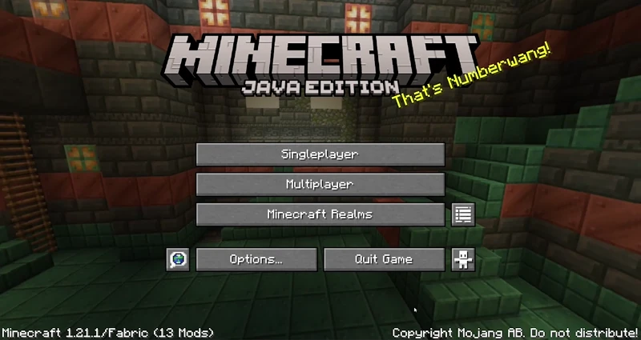
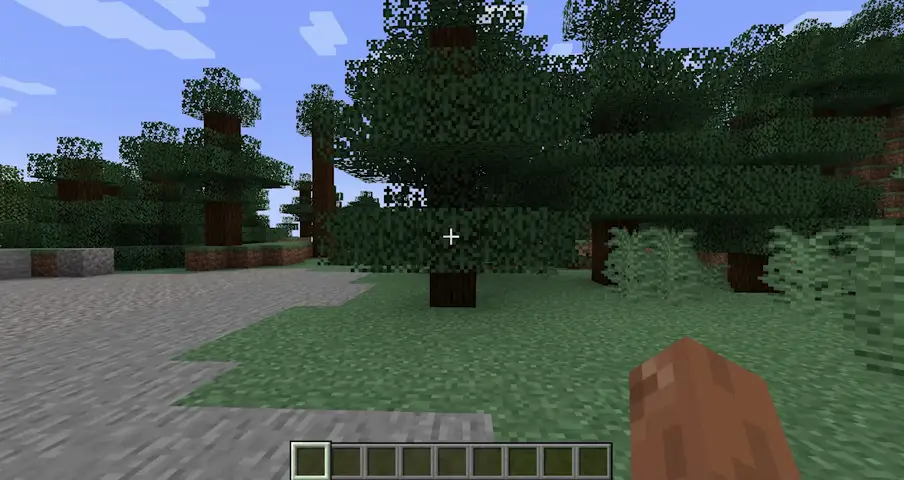
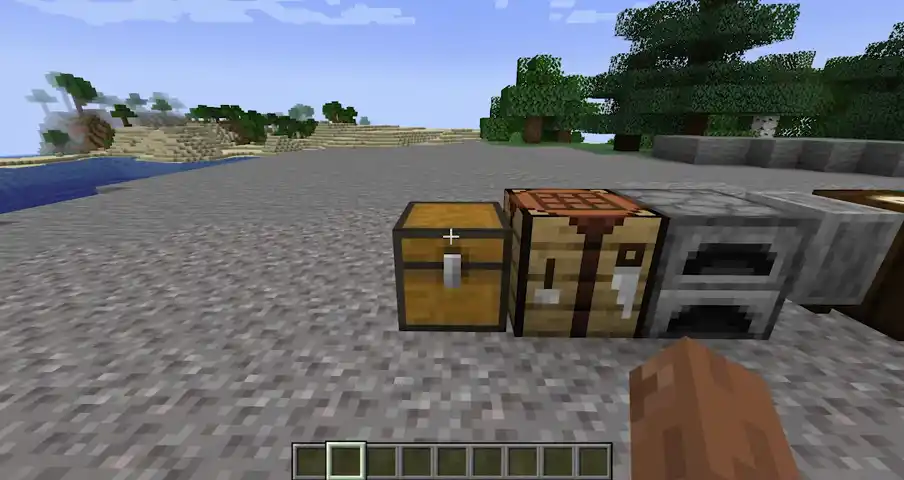
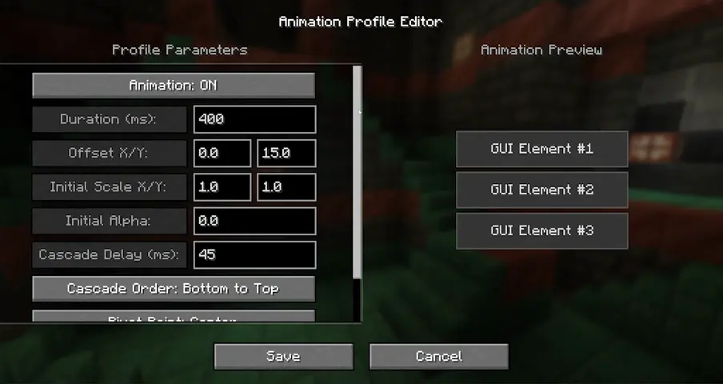
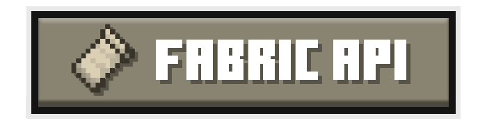

  <h3>EaseGUI is a client-side mod that adds smooth, dynamic entry animations to Minecraft screens and interfaces!</h3>

  
  
  
  

  
  
  
  

---

  <h2>Animated Elements</h2>
  <b>Background Blur • Minecraft Logo • Buttons • Text Labels • Scrollable Lists • Containers</b>

  <h2>Fabric Requirements</h2>

  
  

## Building

JDK version depends on the MC version

Build: `./gradlew build`  
Build for a specific platform:

* Fabric: `./gradlew :fabric:build`
* (Neo)Forge:  `./gradlew :neoforge:build`

## Contributing

### 🌐 Translations

> You can help by adding a translation of EaseGUI into your language!
> - Just add a new `.json` file in `src/main/resources/assets/easegui/lang/` folder (e.g., `ru_ru.json`, `es_es.json`)
> - You can copy `en_us.json` as a template (make sure it's copied from the latest version branch)
> - Open a PR or just send the file in a GitHub Issues, and I'll add it!